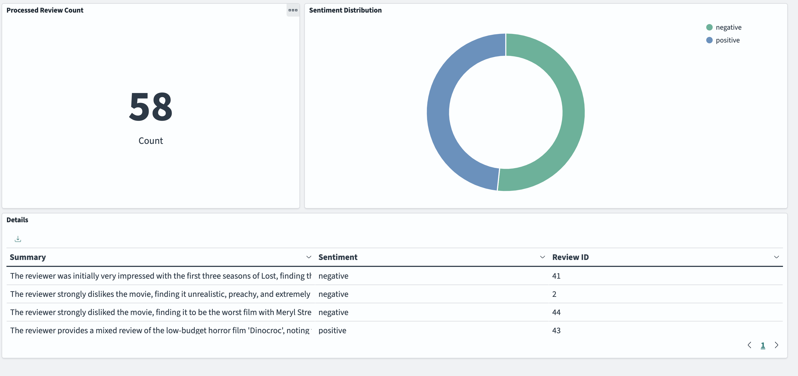
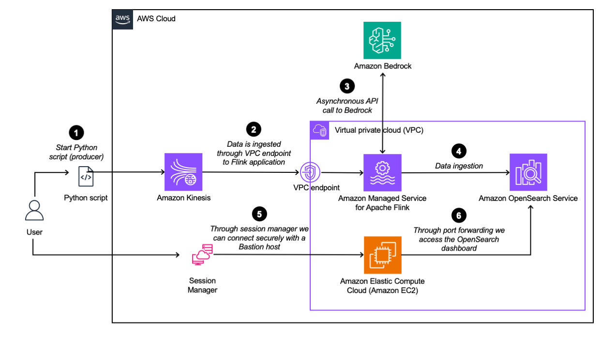

# Streaming Generative AI Application on AWS

## Overview 

This repository contains the code to show how to easily incorporate generative AI into a real-time streaming pipeline. More specifically, we make use of Flink's Async I/O API to make asynchronous requests to the Amazon Bedrock API and process the incoming review stream. The processed reviews are streamed to Amazon OpenSearch and can be viewed in an OpenSearch Dashboard.

This repository is intended to get developers started experimenting with generative AI and streaming data on AWS.



## Architecture Diagram 



The architecture diagram is divided into two parts: the real-time streaming pipeline and access details to the Amazon OpenSearch Dashboard. The pipeline starts with a Python script simulating a producer that sends reviews from the Large Movie Review Dataset to Amazon Kinesis. These reviews are processed through an Amazon Managed Apache Flink application, which makes asynchronous calls to Amazon Bedrock. The results are then loaded into an Amazon OpenSearch cluster for visualization.

For dashboard access, we use a bastion host in the same VPC subnet as the OpenSearch cluster. Connection to this host is secured via Amazon Systems Manager's Session Manager, which allows secure connectivity without open inbound ports, enabling local access to the dashboard through port forwarding. 

## Pre-requisites
* [An AWS account](https://console.aws.amazon.com/console/home?nc2=h_ct&src=header-signin)
* [Apache Maven 3.9.6 or later](https://maven.apache.org/)
* [AWS CLI](https://docs.aws.amazon.com/cli/latest/userguide/getting-started-install.html) 
* [AWS Cloud Development Kit (CDK)](https://aws.amazon.com/cdk/)
* [Python 3.9 or later](https://www.python.org/downloads/)
* [Session Manager Plugin](https://docs.aws.amazon.com/systems-manager/latest/userguide/session-manager-working-with-install-plugin.html) (Session Manager Plugin is required for access to OpenSearch Dashboards using Session Manager)
* Model access to Anthropic's Claude 3 Haiku model. For setup instructions, refer to [Add model access](https://docs.aws.amazon.com/bedrock/latest/userguide/model-access.html) in the documentation of Amazon Bedrock.
* [Large Movie Review Dataset](https://ai.stanford.edu/~amaas/data/sentiment/)

    *Andrew L. Maas, Raymond E. Daly, Peter T. Pham, Dan Huang, Andrew Y. Ng, and Christopher Potts. (2011). [Learning Word Vectors for Sentiment Analysis](https://ai.stanford.edu/~amaas/papers/wvSent_acl2011.pdf). The 49th Annual Meeting of the Association for Computational Linguistics (ACL 2011)*

## Getting Started

1. Clone the repository to your desired workspace:

```bash
git clone https://github.com/aws-samples/aws-streaming-generative-ai-application.git
```

2. Move to the flink-async-bedrock directory and build the JAR file:

```bash
cd flink-async-bedrock && mvn clean package
```

3. Afterwards move back to the root of the directory, and then to the cdk directory to deploy the resources in your AWS account. *Note that you have configured the AWS CLI before with your credentials (for more info see [here](https://docs.aws.amazon.com/cli/latest/userguide/cli-chap-configure.html)).*

```bash
cd cdk && npm install & cdk deploy
```

4. Take note of the output values. The output will similar to the output below:

```bash
 ✅  StreamingGenerativeAIStack

✨  Deployment time: 1414.26s

Outputs:
StreamingGenerativeAIStack.BastionHostBastionHostIdC743CBD6 = i-0970816fa778f9821
StreamingGenerativeAIStack.accessOpenSearchClusterOutput = aws ssm start-session --target i-0970816fa778f9821 --document-name AWS-StartPortForwardingSessionToRemoteHost --parameters '{"portNumber":["443"],"localPortNumber":["8157"], "host":["vpc-generative-ai-opensearch-qfssmne2lwpzpzheoue7rkylmi.us-east-1.es.amazonaws.com"]}'
StreamingGenerativeAIStack.bastionHostIdOutput = i-0970816fa778f9821
StreamingGenerativeAIStack.domainEndpoint = vpc-generative-ai-opensearch-qfssmne2lwpzpzheoue7rkylmi.us-east-1.es.amazonaws.com
StreamingGenerativeAIStack.regionOutput = us-east-1
Stack ARN:
arn:aws:cloudformation:us-east-1:<AWS Account ID>:stack/StreamingGenerativeAIStack/3dec75f0-cc9e-11ee-9b16-12348a4fbf87

✨  Total time: 1418.61s
```

5. Establish connection to the OpenSearch cluster:

_For Linux/Mac:_

Run the following command to establish connection to OpenSearch in a separate terminal window. The command can be found as output `accessOpenSearchClusterOutput`:

```bash
aws ssm start-session --target <BastionHostId> --document-name AWS-StartPortForwardingSessionToRemoteHost --parameters '{"portNumber":["443"],"localPortNumber":["8157"], "host":["<OpenSearchDomainHost>"]}'
```

_For Windows:_

Open a separate Windows cmd terminal. 

```Windows cmd
aws ssm start-session ^
    --target <BastionHostId> ^
    --document-name AWS-StartPortForwardingSessionToRemoteHost ^
    --parameters host="<OpenSearchDomainHost>",portNumber="443",localPortNumber="8157"
```

6. Create the required index in Amazon OpenSearch:

_For Linux/Mac:_

```bash
curl --location -k --request PUT https://localhost:8157/processed_reviews \
--header 'Content-Type: application/json' \
--data-raw '{
  "mappings": {
    "properties": {
        "reviewId": {"type": "integer"},
        "userId": {"type": "keyword"},
        "summary": {"type": "keyword"},
        "sentiment": {"type": "keyword"},
        "dateTime": {"type": "date"}}
    }
  }
}'
```

_For Windows: (Note: Ensure you are using Powershell 7+):_
```bash
$url = "https://localhost:8157/processed_reviews"
$headers = @{
    "Content-Type" = "application/json"
}
$body = @{
    "mappings" = @{
        "properties" = @{
            "reviewId" = @{ "type" = "integer" }
            "userId" = @{ "type" = "keyword" }
            "summary" = @{ "type" = "keyword" }
            "sentiment" = @{ "type" = "keyword" }
            "dateTime" = @{ "type" = "date" }
        }
    }
} | ConvertTo-Json -Depth 3

Invoke-RestMethod -Method Put -Uri $url -Headers $headers -Body $body -SkipCertificateCheck
```

7. Open the OpenSearch Dashboard: 

- Open your browser and access `https://localhost:8157/_dashboards`
- Open the menu and click on *Dashboards Management* under *Management*, then click on *Saved Objects* and import *export.ndjson* which can be found in the `resources` folder.

8. Download the review data [here](https://ai.stanford.edu/~amaas/data/sentiment/).
9. After the download is complete, extract the `.tar.gz` file to retrieve the folder named `aclImdb 3` or similar that contains the review data. Rename the review data folder to `aclImdb`.
10. Move the extracted folder inside the `data/` directory within the downloaded repository.

11. Modify the `DATA_DIR` path in `producer/produce.py` as required. Be sure to also adapt the `AWS_REGION` constant if you are deploying this in a region other than `us-east-1`.

12. Install the required dependencies and start generating data:

```bash
cd producer 
pip install -r requirements.txt
python produce.py
``` 

## Clean up 

Delete the StreamingGenerativeAI-Stack in your AWS account.

```bash
cd cdk && cdk destroy
```

Note: You may have to delete the *AWSServiceRoleForAmazonElasticsearchService* separately. 


## Authors

- [Michelle Pfister](https://github.com/meilipfi)
- [Felix John](https://github.com/Madabaru)

